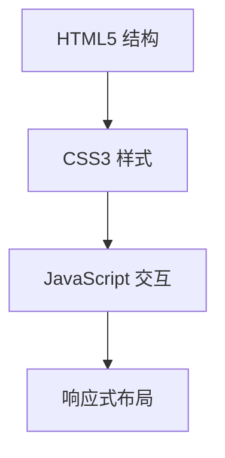

## 1. Architecture Design
本项目为纯静态网站，使用 HTML5、CSS3 和原生 JavaScript 实现。



## 2. Technology Description
- 前端：HTML5 + CSS3 + Vanilla JavaScript
- 无后端依赖
- 部署：GitHub Pages

## 3. File Structure
```
/workspace/
├── index.html          # 主页面
├── README.md           # 项目说明
└── _config.yml         # Jekyll 配置
```

## 4. Responsive Strategy
- 使用 CSS Flexbox 和 Grid 布局
- 媒体查询断点：
  - 移动端：< 768px
  - 平板端：768px - 1024px
  - 桌面端：> 1024px
- 使用 rem 单位实现弹性布局
- 图片自适应加载
