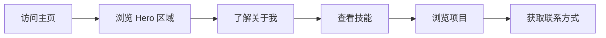

## 1. Product Overview
个人主页项目，用于展示个人信息、技能和项目作品集。目标是创建一个美观、响应式的个人展示页面。

## 2. Core Features

### 2.1 Feature Module
1. **Home page**: Hero 区域、关于我、技能展示、项目作品、联系信息

### 2.3 Page Details
| Page Name | Module Name | Feature description |
|-----------|-------------|---------------------|
| Home page | Hero section | 个人姓名、简短介绍、头像 |
| Home page | About section | 个人背景、专业领域介绍 |
| Home page | Skills section | 技能图标和描述 |
| Home page | Projects section | 项目卡片展示 |
| Home page | Contact section | 联系方式链接 |

## 3. Core Process
用户访问个人主页 → 浏览各个模块内容 → 通过联系模块与我取得联系

## 4. User Interface Design
### 4.1 Design Style
- 主色调：深蓝色 (#0d1117) 和青色 (#58a6ff)
- 按钮风格：圆角、悬停效果
- 字体：使用现代无衬线字体，标题使用醒目字体
- 布局风格：卡片式布局，纵向滚动
- 图标风格：简洁线性图标

### 4.2 Page Design Overview
| Page Name | Module Name | UI Elements |
|-----------|-------------|-------------|
| Home page | Hero section | 全屏横幅、渐变背景、居中布局、淡入动画 |
| Home page | About section | 双列布局、文本与图片配合、平滑滚动 |
| Home page | Skills section | 网格布局、图标卡片、悬停放大效果 |
| Home page | Projects section | 瀑布流卡片、项目截图、技术标签 |
| Home page | Contact section | 社交媒体图标、邮件链接、悬浮动画 |

### 4.3 Responsiveness
- 桌面优先设计，移动端完全自适应
- 触摸优化，按钮和链接足够大便于点击
- 在小屏幕上单列布局，大屏幕上多列展示

### 4.4 3D Scene Guidance
本项目暂不包含 3D 场景
